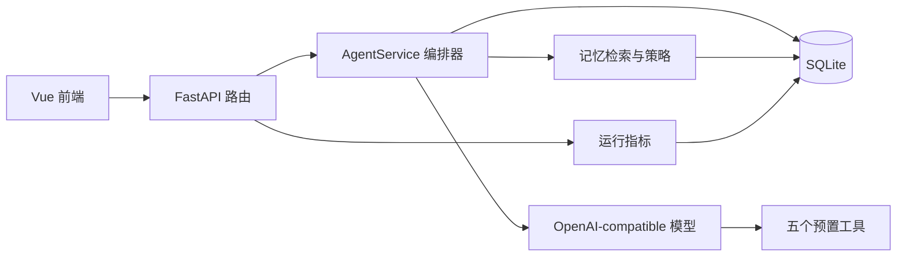

# StudyFlow Memory 团队开发与后端接口说明

> 文档依据：当前 `D:\黑客松` 项目代码  
> 更新日期：2026-08-25  
> 后端版本：`0.1.0`  
> 适用对象：前端开发、后端开发、评测与答辩材料负责人

## 1. 文档目的

这份文档用于帮助团队成员快速理解当前已经实现的系统、完成前后端联调，并在不破坏记忆规则的前提下继续开发。

本文只描述当前代码中已经存在的能力。旧方案中尚未落地的登录鉴权、完整 20 场景评测、学习会话状态机、好友视频、RTC、虚拟人物和鸿蒙原生能力，不作为当前后端已实现功能。

如果只想马上联调，优先阅读：

1. 第 3 节“系统如何工作”；
2. 第 7 节“接口总览”；
3. 第 8 节“接口详细说明”；
4. 第 11 节“本地启动”；
5. 第 13 节“前端联调建议”。

## 2. 项目定位与当前能力

StudyFlow Memory 是一个面向重复性课程学习任务的反馈记忆 Agent。当前演示课程为“数据结构与算法”，但接口中的课程、任务类型和知识点均为普通字符串，可以扩展到其他课程。

系统当前可以完成：

- 根据课程目标和可用时间生成一个可执行微任务；
- 通过真实大模型 Tool Calling 调用后端预置工具；
- 保存用户明确表达的任务时长和解释方式偏好；
- 将模型推断但尚未确认的偏好保存为候选记忆；
- 在后续相似任务中检索并应用已确认记忆；
- 进行“复述—关联—迁移”三级形成性理解检验；
- 保存用户回答对应的知识状态；
- 根据时间不足、任务太难、杂事干扰或疲劳生成恢复动作；
- 用户接受恢复动作后，将它保存为可复用的恢复经验；
- 管理记忆的确认、修改、拒绝、撤销和软删除；
- 对比有记忆和无记忆两种计划结果；
- 记录 Token、检索耗时、模型耗时、工具调用和失败信息。

当前后端不是纯规则程序。三个 Agent 主接口均通过 OpenAI-compatible Chat Completions 调用模型，并要求模型先选择预置工具。后端负责约束工具范围、校验参数、执行工具、解析最终 JSON 和落库。

## 3. 系统如何工作

### 3.1 总体调用关系



一次 Agent 请求的标准过程：

1. FastAPI 使用 Pydantic 校验 HTTP 请求；
2. `AgentService` 按用户、课程、任务类型、知识点等条件检索最多 5 条记忆；
3. 只有 `confirmed` 记忆允许进入模型决策上下文；
4. 第一次模型请求使用 `tool_choice=required`，强制模型调用工具；
5. 后端校验模型选择的工具名称和参数；
6. 后端执行工具，并把工具结果作为 `role=tool` 消息返回模型；
7. 模型返回最终 JSON；
8. 后端校验必需字段，保存业务数据和 `agent_runs` 指标；
9. HTTP 响应返回业务结果、三组记忆 ID 和本轮指标。

模型不能直接访问 SQLite，也不能绕过后端工具修改数据。

### 3.2 当前代码依赖方向

```text
api/routes + schemas
        ↓
agents/orchestrator.py
        ↓
agents/tools + memory policies + domain contracts
        ↓
infrastructure/repositories + infrastructure/llm + telemetry
        ↓
SQLite / 模型服务
```

当前 `application/use_cases/` 中的文件主要是薄封装和扩展入口。三个 Agent 路由现在直接调用 `AgentService`，核心业务编排位于：

```text
backend/app/agents/orchestrator.py
```

团队成员不要误以为旧架构说明中的全部业务已经迁移到 Use Case 文件。

## 4. 目录与关键文件

### 4.1 后端目录

```text
backend/
├─ pyproject.toml                         Python 包和依赖
├─ mock_server.py                         本地联调启动入口，实际调用真实模型
├─ verify_contract.py                     记忆契约验证脚本
├─ app/
│  ├─ main.py                             FastAPI 入口、CORS、异常处理和路由注册
│  ├─ api/
│  │  ├─ dependencies.py                  DB、仓储、LLM 和 AgentService 依赖注入
│  │  └─ routes/
│  │     ├─ agent.py                      计划、理解检验、恢复接口
│  │     ├─ feedback.py                   反馈分类和记忆写入
│  │     ├─ memories.py                   记忆 CRUD 与软删除
│  │     ├─ evaluation.py                 有记忆/无记忆对照
│  │     └─ metrics.py                    运行指标汇总
│  ├─ agents/
│  │  ├─ orchestrator.py                  Agent 核心编排器
│  │  ├─ tool_registry.py                 工具 Schema、白名单和参数校验
│  │  ├─ prompts/                         四类系统提示词
│  │  └─ tools/                           五个服务端工具
│  ├─ domain/
│  │  ├─ entities/memory.py               Memory 领域实体
│  │  ├─ value_objects/memory_type.py     共享枚举
│  │  └─ repositories/                    仓储抽象接口
│  ├─ memory/
│  │  ├─ policy.py                        确认、可用和删除规则
│  │  ├─ retriever.py                     检索、候选和实际使用分组
│  │  ├─ ranker.py                        记忆排序
│  │  └─ writer.py                        统一写入与使用记录
│  ├─ infrastructure/
│  │  ├─ database.py                      SQLAlchemy Engine、Session、建表与兼容升级
│  │  ├─ models/                          SQLite ORM 表
│  │  ├─ repositories/                    内存版与 SQLite 版记忆仓储
│  │  ├─ llm/                             模型抽象和 OpenAI-compatible 客户端
│  │  └─ telemetry/                       Token、延迟和运行记录
│  └─ schemas/                            HTTP 请求/响应 Pydantic 模型
└─ tests/
   ├─ unit/                               工具、记忆、模型客户端和边界测试
   └─ integration/                        API、事务和完整闭环测试
```

### 4.2 新代码应该放在哪里

| 新增内容 | 推荐位置 |
| --- | --- |
| 新 HTTP 路由 | `backend/app/api/routes/` |
| 请求和响应字段 | `backend/app/schemas/` |
| Agent 流程编排 | `backend/app/agents/orchestrator.py`，复杂后再拆服务 |
| 单一、可校验的 Agent 动作 | `backend/app/agents/tools/` 并注册到 `tool_registry.py` |
| 记忆生命周期规则 | `backend/app/memory/` |
| 稳定业务实体和枚举 | `backend/app/domain/` |
| SQLite 表 | `backend/app/infrastructure/models/` |
| 仓储实现 | `backend/app/infrastructure/repositories/` |
| 模型供应商兼容代码 | `backend/app/infrastructure/llm/` |
| Token、延迟和运行审计 | `backend/app/infrastructure/telemetry/` |
| 单元测试 | `backend/tests/unit/` |
| 接口闭环测试 | `backend/tests/integration/` |

## 5. 核心业务流程

### 5.1 计划流程 `/agent/plan`

用途：根据学习目标和可用时间生成一个微任务。

当前行为：

1. 只检索 `task_preference`；
2. 从已确认记忆中解析“多少分钟”的偏好；
3. 读取当前课程任务和知识状态；
4. 让模型调用 `split_learning_task`，必要时再调用 `adjust_learning_plan`；
5. 实际任务时长永远不超过 `available_minutes`；
6. 没有有效时长偏好时默认生成 25 分钟任务；
7. 普通请求将任务保存到 `tasks`；
8. 如果当前知识点存在较低理解层级，解释中追加前置提醒。

如果用户偏好 30 分钟，但本次只有 20 分钟可用，最终任务必须是 20 分钟，并在解释中说明受到当前可用时间限制。

### 5.2 理解检验 `/agent/check`

用途：执行复述、关联或迁移层级的一次一问理解检验。

当前行为：

1. 只检索 `explanation_preference`；
2. 支持 `example_first`、`definition_first`、`diagram_first`；
3. 工具生成问题，模型生成回答反馈和缺失维度；
4. `level` 表示请求的提问层级；
5. `assessed_level` 表示模型根据用户答案评估出的形成性理解层级；
6. 只有请求中提供了非空 `answer`，才更新 `knowledge_states`；
7. 知识状态不写入普通 `memories` 表。

三种层级：

| 值 | 含义 |
| --- | --- |
| `recall` | 用自己的话复述核心概念 |
| `relate` | 说明和已学概念的联系 |
| `transfer` | 将知识应用到新场景 |

### 5.3 学习恢复 `/agent/recover`

用途：用户学习受阻时生成一个低压力恢复动作。

阻塞类型：

| 值 | 含义 |
| --- | --- |
| `time` | 时间不足 |
| `too_hard` | 任务太难 |
| `distraction` | 杂事干扰 |
| `fatigue` | 状态疲劳 |

当前行为：

1. 只检索与课程、任务类型、知识点、阻塞类型匹配的 `recovery_experience`；
2. 如果命中已确认经验，工具优先复用历史动作；
3. `user_acceptance=true` 时，把本轮实际动作保存为 `confirmed recovery_experience`；
4. `user_acceptance=false` 或未提供时，不创建长期恢复记忆；
5. 恢复记忆与成功运行记录在同一事务中提交。

当前接口没有单独的“接受某条已生成建议”端点。前端如需先预览后确认，可以：

1. 第一次请求不传 `user_acceptance`，仅展示动作；
2. 用户接受后，用相同上下文再次请求并传 `user_acceptance=true`；
3. 后端保存确认请求中返回的实际动作。

如果后续需要确保保存的就是第一次展示的原文，建议另行设计带 `run_id` 或 `action` 的确认接口，不要直接在前端假设两次模型输出一定相同。

### 5.4 反馈闭环 `/feedback`

接口支持两种模式。

#### 模式 A：前端已明确反馈类型

前端传入 `feedback_type`。该请求不会调用模型分类。

```json
{
  "user_id": "demo-user",
  "course": "数据结构与算法",
  "feedback_type": "task_preference",
  "content": "以后任务控制在20分钟",
  "explicit": true,
  "task_type": "study"
}
```

- `explicit=true`：保存为 `confirmed`；
- `explicit=false` 或未传：保存为 `pending`；
- 已分类模式的默认置信度目前为 `0.5`。

#### 模式 B：只提交自然语言

不传 `feedback_type`，后端调用模型输出受控分类结构，再由后端写库。

```json
{
  "user_id": "demo-user",
  "course": "数据结构与算法",
  "content": "以后请先给我看例子，再讲定义",
  "task_type": "study",
  "knowledge_point": "BFS"
}
```

模型只负责生成候选分类：

```json
{
  "memory_type": "explanation_preference",
  "explicit": true,
  "confidence": 0.95,
  "block_type": null
}
```

模型不能直接写数据库。分类格式无效时只修复一次；仍失败则整个请求失败，不写入反馈和记忆。

如果请求显式传了 `explicit`，它优先于模型对 `explicit` 的判断。

### 5.5 记忆管理 `/memories`

记忆中心可以：

- 查询全部或按条件过滤；
- 查看单条记忆；
- 修改内容和置信度；
- 将候选记忆确认或拒绝；
- 将记忆撤销为 `archived`；
- 通过 DELETE 软删除。

普通 DELETE 只会把 `active` 更新为 `false`，不会物理删除数据库记录。物理 `repository.delete()` 只用于测试或维护任务。

### 5.6 评测对照 `/evaluation/compare`

接口对同一计划请求执行两次独立 Agent 调用：

- `evaluation_with_memory`：正常检索并使用记忆；
- `evaluation_without_memory`：不检索、不注入记忆。

两组均不写入正式 `tasks`，但会写入 `agent_runs` 作为评测运行记录。

当前接口只对“计划”进行单次有/无记忆对照，不等于 C 负责人的完整 20 场景评测系统。

## 6. 五个 Agent 工具

| 工具 | 允许出现的流程 | 功能 | 关键输出 |
| --- | --- | --- | --- |
| `get_learning_state` | 计划、理解检验、恢复 | 读取用户当前课程的任务和知识状态 | `tasks`、`knowledge_states` |
| `split_learning_task` | 计划 | 将目标拆成一个 1～240 分钟且不超过可用时间的任务 | 任务 ID、标题、描述、时长 |
| `adjust_learning_plan` | 计划 | 用确认的时长偏好调整已有任务 | 调整后的任务 |
| `generate_understanding_question` | 理解检验 | 按层级和解释方式生成单个问题 | `level`、`question` |
| `generate_recovery_action` | 恢复 | 按阻塞原因生成或复用一个恢复动作 | `action`、`reason` |

工具安全约束：

- 每个流程只能使用自己的工具白名单；
- 工具参数由 Pydantic 再次验证；
- 模型选择未授权工具时返回 `unknown_tool`；
- 模型参数无效时返回 `invalid_tool_arguments`；
- 单次 Agent 最多记录 5 次工具调用；
- 工具 JSON Schema 会展开 `$defs/$ref`，兼容不支持本地引用的供应商。

## 7. HTTP 接口总览

本地基础地址：

```text
http://127.0.0.1:8000
```

Swagger：

```text
http://127.0.0.1:8000/docs
```

当前共有 12 个业务/运维接口：

| 方法 | 路径 | 功能 | 是否调用模型 |
| --- | --- | --- | --- |
| `GET` | `/health` | 健康检查 | 否 |
| `POST` | `/agent/plan` | 生成学习计划 | 是 |
| `POST` | `/agent/check` | 理解检验 | 是 |
| `POST` | `/agent/recover` | 学习恢复 | 是 |
| `POST` | `/feedback` | 提交反馈并生成记忆 | 视请求而定 |
| `POST` | `/memories` | 手动创建记忆 | 否 |
| `GET` | `/memories` | 查询记忆列表 | 否 |
| `GET` | `/memories/{memory_id}` | 查询单条记忆 | 否 |
| `PATCH` | `/memories/{memory_id}` | 修改、确认、拒绝或撤销 | 否 |
| `DELETE` | `/memories/{memory_id}` | 软删除记忆 | 否 |
| `POST` | `/evaluation/compare` | 有记忆/无记忆对照 | 是，两次 |
| `GET` | `/metrics` | 查询运行指标 | 否 |

当前没有登录鉴权，`user_id` 由调用方传入。团队联调时必须为同一个演示用户使用稳定一致的 `user_id`，否则后续请求无法命中此前记忆。

## 8. 接口详细说明

### 8.1 `GET /health`

用途：确认 FastAPI 服务已启动。

响应：

```json
{
  "status": "ok"
}
```

### 8.2 `POST /agent/plan`

请求字段：

| 字段 | 类型 | 必填 | 说明 |
| --- | --- | --- | --- |
| `user_id` | string | 是 | 用户标识 |
| `course` | string | 是 | 课程名称 |
| `goal` | string | 是 | 非空学习目标 |
| `available_minutes` | integer | 是 | 当前可用时间，1～240 |
| `task_type` | string | 否 | 默认 `study` |
| `knowledge_point` | string/null | 否 | 当前知识点 |

请求示例：

```json
{
  "user_id": "demo-user",
  "course": "数据结构与算法",
  "goal": "学习图的BFS",
  "available_minutes": 25,
  "task_type": "study",
  "knowledge_point": "BFS"
}
```

响应结构示例：

```json
{
  "tasks": [
    {
      "id": "生成的任务ID",
      "title": "学习图的BFS",
      "description": "用20分钟完成：学习图的BFS",
      "duration_minutes": 20,
      "task_type": "study",
      "knowledge_point": "BFS"
    }
  ],
  "explanation": "根据你已确认的任务时长偏好，本次按20分钟拆分。",
  "retrieved_memory_ids": ["记忆ID"],
  "used_memory_ids": ["记忆ID"],
  "candidate_memory_ids": [],
  "metrics": {
    "input_tokens": 500,
    "memory_tokens": 8,
    "output_tokens": 100,
    "retrieval_latency_ms": 2,
    "model_latency_ms": 3500
  }
}
```

模型文字可能变化，前端不要依赖完整 `explanation` 文案做业务判断，应依赖任务字段和三组记忆 ID。

### 8.3 `POST /agent/check`

请求字段：

| 字段 | 类型 | 必填 | 说明 |
| --- | --- | --- | --- |
| `user_id` | string | 是 | 用户标识 |
| `course` | string | 是 | 课程名称 |
| `knowledge_point` | string | 是 | 检验知识点 |
| `task_type` | string | 否 | 默认 `study` |
| `material` | string | 否 | 课程材料，默认空字符串 |
| `level` | enum | 否 | `recall`/`relate`/`transfer`，默认 `recall` |
| `answer` | string/null | 否 | 用户回答；提供后才更新知识状态 |

首次出题：

```json
{
  "user_id": "demo-user",
  "course": "数据结构与算法",
  "knowledge_point": "BFS",
  "task_type": "study",
  "material": "BFS使用队列按层遍历图。",
  "level": "recall"
}
```

提交回答：

```json
{
  "user_id": "demo-user",
  "course": "数据结构与算法",
  "knowledge_point": "BFS",
  "task_type": "study",
  "material": "BFS使用队列按层遍历图。",
  "level": "recall",
  "answer": "BFS从起点开始，使用队列逐层访问相邻节点。"
}
```

响应结构：

```json
{
  "level": "recall",
  "assessed_level": "recall",
  "question": "BFS：请用自己的话复述这个知识点的核心概念，并说明它解决什么问题？",
  "feedback": "你说明了逐层访问，但还需要解释队列先进先出的作用。",
  "missing_dimensions": ["队列先进先出的作用"],
  "retrieved_memory_ids": [],
  "used_memory_ids": [],
  "candidate_memory_ids": [],
  "metrics": {
    "input_tokens": 500,
    "memory_tokens": 0,
    "output_tokens": 100,
    "retrieval_latency_ms": 1,
    "model_latency_ms": 3200
  }
}
```

没有回答时 `assessed_level` 可以为 `null`；存在回答时必须是三个合法层级之一，否则接口返回模型输出错误。

### 8.4 `POST /agent/recover`

请求字段：

| 字段 | 类型 | 必填 | 说明 |
| --- | --- | --- | --- |
| `user_id` | string | 是 | 用户标识 |
| `course` | string | 是 | 课程名称 |
| `block_type` | enum | 是 | `time`/`too_hard`/`distraction`/`fatigue` |
| `context` | string | 否 | 用户对阻塞的描述 |
| `task_type` | string | 否 | 默认 `study` |
| `knowledge_point` | string/null | 否 | 当前知识点 |
| `user_acceptance` | boolean/null | 否 | `true` 时保存本轮恢复经验 |

请求示例：

```json
{
  "user_id": "demo-user",
  "course": "数据结构与算法",
  "block_type": "too_hard",
  "context": "不理解队列为什么用于BFS",
  "task_type": "study",
  "knowledge_point": "BFS",
  "user_acceptance": true
}
```

响应结构：

```json
{
  "action": "先看一个遍历示例，再完成一道最小练习。",
  "reason": "根据当前阻塞情况生成一个低压力恢复动作。",
  "retrieved_memory_ids": [],
  "used_memory_ids": [],
  "candidate_memory_ids": [],
  "metrics": {
    "input_tokens": 400,
    "memory_tokens": 0,
    "output_tokens": 80,
    "retrieval_latency_ms": 1,
    "model_latency_ms": 2800
  }
}
```

本次新建的恢复记忆不会出现在同一次响应的 `used_memory_ids`；它会在后续相同条件的请求中被召回和使用。

### 8.5 `POST /feedback`

请求字段：

| 字段 | 类型 | 必填 | 说明 |
| --- | --- | --- | --- |
| `user_id` | string | 是 | 用户标识 |
| `course` | string | 是 | 课程名称 |
| `feedback_type` | enum/null | 否 | 不传时由模型分类 |
| `content` | string | 是 | 非空反馈文本 |
| `explicit` | boolean/null | 否 | 用户是否明确表达；显式值优先于模型 |
| `task_type` | string/null | 否 | 任务范围 |
| `knowledge_point` | string/null | 否 | 知识点范围 |
| `block_type` | enum/null | 否 | 阻塞范围 |

允许的普通反馈记忆类型：

- `task_preference`
- `explanation_preference`
- `recovery_experience`
- `review_schedule`

`knowledge_state` 不允许通过本接口创建，必须通过 `/agent/check` 的用户回答更新。

成功响应：

```json
{
  "feedback_id": "反馈ID",
  "memories": [
    {
      "id": "记忆ID",
      "user_id": "demo-user",
      "memory_type": "explanation_preference",
      "course": "数据结构与算法",
      "task_type": "study",
      "knowledge_point": "BFS",
      "block_type": null,
      "content": "以后请先给我看例子，再讲定义",
      "source_feedback": "反馈ID",
      "confidence": 0.95,
      "confirmation_status": "confirmed",
      "created_at": "2026-08-25T10:00:00Z",
      "last_used_at": null,
      "use_count": 0,
      "active": true
    }
  ]
}
```

### 8.6 `POST /memories`

用途：由记忆中心、演示脚本或测试直接创建一条记忆。普通用户反馈更推荐走 `/feedback`。

```json
{
  "user_id": "demo-user",
  "memory_type": "task_preference",
  "course": "数据结构与算法",
  "content": "以后任务控制在20分钟",
  "task_type": "study",
  "knowledge_point": null,
  "block_type": null,
  "source_feedback": null,
  "confidence": 1.0,
  "confirmation_status": "confirmed"
}
```

成功状态码：`201`。响应为完整 `MemoryOut`。

直接创建 `knowledge_state` 会返回 `422 unsupported_memory_type`。

### 8.7 `GET /memories`

可选查询参数：

- `user_id`
- `memory_type`
- `course`
- `task_type`
- `knowledge_point`
- `block_type`
- `confirmation_status`
- `active`

`active` 默认是 `true`，因此普通列表不会显示软删除记录。查看软删除记录需要显式传 `active=false`。

示例：

```text
GET /memories?user_id=demo-user&course=数据结构与算法&active=true
```

响应：

```json
{
  "items": [],
  "total": 0
}
```

### 8.8 `GET /memories/{memory_id}`

用途：查询单条记忆，包括已软删除记录。

- 找到：`200` + `MemoryOut`；
- 未找到：`404`，`detail` 为 `Memory not found`。

### 8.9 `PATCH /memories/{memory_id}`

可修改字段：

```json
{
  "content": "以后任务控制在15分钟",
  "confidence": 1.0,
  "confirmation_status": "confirmed",
  "active": true,
  "task_type": "study",
  "knowledge_point": "BFS",
  "block_type": null,
  "source_feedback": "人工修订"
}
```

常见操作：

```json
{ "confirmation_status": "confirmed" }
```

```json
{ "confirmation_status": "rejected" }
```

```json
{ "confirmation_status": "archived" }
```

当前 MVP 的部分更新语义不能通过传 `null` 清空可空字段，因为领域 `MemoryUpdate` 使用 `None` 表示“不修改”。

### 8.10 `DELETE /memories/{memory_id}`

用途：用户软删除。

- 成功：`204 No Content`；
- 实际行为：`active=false`；
- 删除后 Agent 不再检索该记忆；
- 记录仍保留用于审计。

### 8.11 `POST /evaluation/compare`

请求：

```json
{
  "user_id": "demo-user",
  "course": "数据结构与算法",
  "goal": "学习拓扑排序",
  "available_minutes": 25,
  "task_type": "study",
  "knowledge_point": "拓扑排序"
}
```

响应结构：

```json
{
  "without_memory": {
    "tasks": [],
    "explanation": "无记忆模式说明",
    "retrieved_memory_ids": [],
    "used_memory_ids": [],
    "candidate_memory_ids": [],
    "metrics": {}
  },
  "with_memory": {
    "tasks": [],
    "explanation": "有记忆模式说明",
    "retrieved_memory_ids": ["记忆ID"],
    "used_memory_ids": ["记忆ID"],
    "candidate_memory_ids": [],
    "metrics": {}
  },
  "delta": {
    "duration_minutes": -5,
    "memory_count": 1,
    "memory_tokens": 8,
    "with_memory_operation": "evaluation_with_memory",
    "without_memory_operation": "evaluation_without_memory"
  }
}
```

`duration_minutes` 的计算方式是“有记忆时长减无记忆时长”。

### 8.12 `GET /metrics`

返回全部已记录 Agent 运行的汇总与明细，主要字段：

- `agent_runs`
- `success_count` / `failure_count`
- `input_tokens` / `memory_tokens` / `output_tokens`
- `retrieval_latency_ms` / `model_latency_ms`
- `retrieval_latency_ms_percentiles.p50/p95`
- `model_latency_ms_percentiles.p50/p95`
- `retry_count`
- `format_repair_count`
- `models`
- `operation_counts`
- `memory_counts.retrieved/used/candidate`
- `errors`
- `runs`
- 三组汇总记忆 ID

`memory_tokens` 是本地估算的“实际注入 confirmed 记忆文本”成本，不是供应商返回的独立计费字段。`input_tokens` 和 `output_tokens` 优先采用模型供应商响应中的 `usage`。

当前 `/metrics` 没有分页，会返回全部运行明细，适合比赛 MVP 和评测面板，不建议直接作为长期生产日志接口。

## 9. 记忆契约

### 9.1 记忆类型

| 值 | 当前用途 |
| --- | --- |
| `task_preference` | 时长、拆分粒度、提醒等任务偏好；当前计划流程实际应用分钟偏好 |
| `explanation_preference` | 示例、定义、图示优先 |
| `knowledge_state` | 枚举保留；实际状态写入独立 `knowledge_states` 表，不允许普通创建 |
| `recovery_experience` | 某类阻塞下被接受的恢复动作 |
| `review_schedule` | 复习安排；可存储和管理，当前三个 Agent 主流程尚未消费它 |

### 9.2 确认状态

| 状态 | 是否可召回 | 是否可改变 Agent 输出 |
| --- | --- | --- |
| `pending` | 是 | 否，只进入 `candidate_memory_ids` |
| `confirmed` | 是 | 是，但必须与当前操作相关且实际改变结果 |
| `rejected` | 否 | 否 |
| `archived` | 否 | 否 |

此外，`active=false` 的记忆永远不可检索。

### 9.3 三组记忆 ID

| 字段 | 含义 |
| --- | --- |
| `retrieved_memory_ids` | 本轮召回的全部可用记忆，包括 confirmed 和 pending |
| `used_memory_ids` | 实际改变工具参数或输出的 confirmed 记忆 |
| `candidate_memory_ids` | 召回但尚未确认的 pending 记忆 |

不要把“召回”直接等同于“使用”。例如一条 confirmed 任务偏好没有合法的分钟信息时，可以被召回，但不应进入 `used_memory_ids`。

### 9.4 检索范围

- 先按 `user_id + course + memory_type` 缩小范围；
- `task_type=null` 的通用记忆可以匹配具体任务类型；
- `knowledge_point=null` 的通用偏好可以匹配具体知识点；
- 具体知识点记忆不能跨知识点误用；
- 恢复经验还必须匹配阻塞类型；
- 每轮最多返回 5 条；
- 记忆文本预算最多约 300 Token；
- 排序优先级为：confirmed、置信度、最近使用时间、使用次数。

## 10. 数据库

当前使用 SQLite + SQLAlchemy，共有 5 张核心表：

| 表 | 用途 |
| --- | --- |
| `tasks` | 正式计划任务 |
| `feedback_events` | 原始反馈事件 |
| `memories` | 偏好、规则和恢复经验 |
| `knowledge_states` | 用户在具体知识点的形成性理解状态 |
| `agent_runs` | 成功/失败、Token、延迟、工具和记忆轨迹 |

默认本地数据库：

```text
D:\黑客松\data\studyflow.db
```

Docker 容器内数据库：

```text
/app/data/studyflow.db
```

Compose 使用 `./data:/app/data` 挂载，因此容器重启后 SQLite 数据仍保留。

应用启动时会执行 `create_all()`，并对旧版 `agent_runs` 表进行小范围幂等兼容升级。当前项目没有完整 Alembic 迁移历史；如果团队后续新增表或大规模改字段，应补正式迁移，不要持续扩展启动时手工 `ALTER TABLE`。

## 11. 配置与本地启动

### 11.1 环境要求

- Python 3.11 或以上；
- 项目虚拟环境：`D:\黑客松\.venv`；
- OpenAI-compatible 模型服务；
- 可选 Docker Desktop；
- 前端开发需要 Node.js 和 npm。

### 11.2 配置模型

复制模板：

```powershell
cd D:\黑客松
Copy-Item .env.example .env
```

配置格式：

```env
APP_ENV=development
DATABASE_URL=sqlite:///../data/studyflow.db
LLM_BASE_URL=https://你的模型服务地址/v1
LLM_API_KEY=只保存在本地的密钥
LLM_MODEL=模型名称
LLM_MAX_RETRIES=2
REQUEST_TIMEOUT_SECONDS=120
```

注意：

- `.env` 已被 Git 忽略，不要提交；
- 不要把 API Key 写进代码、截图、文档或 Dockerfile；
- 客户端会为没有 `/v1` 的地址自动补 `/v1`；
- 未配置模型时，Agent 接口返回 `503 model_not_configured`；
- 不会自动降级为规则 Agent。

### 11.3 安装后端依赖

```powershell
cd D:\黑客松
py -3.11 -m venv .venv
.\.venv\Scripts\python.exe -m pip install -e .\backend
```

已有 `.venv` 时不需要重新创建。

### 11.4 启动后端

推荐方式：

```powershell
cd D:\黑客松\backend
..\.venv\Scripts\python.exe mock_server.py
```

`mock_server.py` 只是历史文件名。它会使用 `.env` 中的真实模型，不是模型 Mock。

也可以：

```powershell
cd D:\黑客松\backend
..\.venv\Scripts\python.exe -m uvicorn app.main:app --host 127.0.0.1 --port 8000
```

验证：

```powershell
Invoke-RestMethod http://127.0.0.1:8000/health
```

### 11.5 Docker 启动

先确保 Docker Desktop 已启动：

```powershell
docker version
docker compose version
```

再执行：

```powershell
cd D:\黑客松
docker compose up --build -d backend
docker compose ps
Invoke-RestMethod http://127.0.0.1:8000/health
docker compose logs backend
```

结束：

```powershell
docker compose down
```

## 12. 错误处理

### 12.1 模型调用错误

统一结构：

```json
{
  "detail": {
    "code": "provider_unavailable",
    "message": "模型调用失败",
    "retry_count": 2
  }
}
```

常见错误码：

| code | 含义 |
| --- | --- |
| `model_not_configured` | 未配置模型地址或 Key |
| `provider_timeout` | 模型请求超时 |
| `provider_unavailable` | 网络或供应商服务不可用 |
| `provider_rejected` | 供应商拒绝请求或参数 |
| `invalid_provider_response` | 供应商响应结构不合法 |
| `invalid_tool_arguments` | 模型生成的工具参数无效 |
| `unknown_tool` | 模型选择了未授权工具 |
| `invalid_tool_order` | 调整计划前没有先生成任务 |
| `missing_required_tool` | 模型没有调用本流程必需工具 |
| `invalid_model_output` | 最终 JSON 或必需字段无效 |
| `tool_call_limit` | 工具调用次数超过限制 |
| `tool_loop_limit` | 工具循环未正常结束 |
| `unsupported_memory_type` | 尝试通过普通记忆接口写知识状态 |

模型最终回答支持：

- 裸 JSON；
- Markdown JSON 代码块；
- 说明文字中唯一且完整的 JSON 对象。

解析或字段校验失败后只进行一次格式修复。修复仍失败就返回错误，不把普通文本伪装成成功结果。

### 12.2 Pydantic 参数错误

请求缺字段、枚举非法、分钟越界或反馈为空时，FastAPI 返回标准 `422` 校验响应。

### 12.3 记忆不存在

记忆查询、更新或删除目标不存在时返回 `404`。

## 13. 前端联调建议

### 13.1 API 服务层

前端已有：

```text
frontend/src/services/api.ts
frontend/src/services/agent.ts
frontend/src/services/memories.ts
frontend/src/services/evaluation.ts
```

组件和页面应通过 service 层访问后端，不要在多个 Vue 文件中重复写 `fetch`。

### 13.2 页面与接口对应关系

| 页面 | 主要接口 |
| --- | --- |
| 今日任务 | `POST /agent/plan`、`POST /feedback` |
| 理解检验 | `POST /agent/check` |
| 思绪星云/学习恢复 | `POST /agent/recover` |
| 记忆中心 | `GET/POST/PATCH/DELETE /memories` |
| 评测面板 | `POST /evaluation/compare`、`GET /metrics` |

### 13.3 前端必须正确处理的状态

- Agent 请求可能需要几十秒，页面应显示加载状态并阻止重复提交；
- 请求超时建议大于后端 `REQUEST_TIMEOUT_SECONDS`；
- 不能只处理 `200`，还要展示结构化 `detail.code`；
- `pending` 记忆显示“待确认”，不能宣称已经影响 Agent；
- `used_memory_ids` 才表示本轮真正应用；
- DELETE 成功是 `204`，没有 JSON 响应体；
- 同一演示用户必须始终使用同一个 `user_id`；
- 模型生成文案不稳定，业务展示应依赖结构化字段。

## 14. 测试与验收

### 14.1 自动化测试

在项目根目录执行：

```powershell
cd D:\黑客松
.\.venv\Scripts\python.exe -m unittest discover -s backend\tests
.\.venv\Scripts\python.exe backend\verify_contract.py
.\.venv\Scripts\python.exe -m compileall -q backend\app backend\verify_contract.py
.\.venv\Scripts\python.exe -m pip check
```

当前基线：

```text
Ran 76 tests
OK
```

自动化测试使用 Fake Adapter 或 `httpx.MockTransport`，不会请求真实模型、不会消耗在线额度，也不会污染正式 SQLite。

### 14.2 建议的手工闭环顺序

使用同一个 `user_id=team-demo`：

1. 调用 `/agent/plan` 学习 BFS，确认默认任务正常；
2. 调用 `/feedback` 保存“以后任务控制在20分钟”，设为 explicit；
3. 再次调用 `/agent/plan`，确认时长变为 20 且 `used_memory_ids` 非空；
4. 保存“先看例子再讲定义”的解释偏好；
5. 调用 `/agent/check`，确认问题出现示例优先引导；
6. 带 `answer` 再调用 `/agent/check`，确认返回合法 `assessed_level`；
7. 调用 `/agent/recover` 且 `user_acceptance=true`，形成恢复经验；
8. 再次调用同范围 `/agent/recover`，确认复用历史动作；
9. 调用 `/evaluation/compare`，检查有记忆和无记忆结果差异；
10. 调用 `/metrics`，检查 Token、延迟、记忆计数和工具轨迹；
11. DELETE 一条记忆后重复请求，确认它不再被使用。

## 15. 团队协作边界

### 15.1 前端负责人

- 按本文 Schema 维护 TypeScript 类型；
- 完成加载、错误、空状态和记忆引用展示；
- 实现 pending 记忆确认/拒绝操作；
- 不在前端重新实现记忆检索和确认规则；
- 不在前端保存或使用模型 API Key。

### 15.2 后端负责人

- 保持路由响应字段向后兼容；
- 修改工具参数时同步修改 Pydantic 模型、工具 Schema 和测试；
- 新记忆规则必须通过 `MemoryRepository` 和 `is_usable`；
- 所有成功/失败 Agent 运行都应保留审计指标；
- 涉及反馈+记忆、恢复经验+运行记录时保持事务一致性。

### 15.3 评测负责人

- 使用稳定测试用户和独立数据库；
- 区分 `retrieved`、`used`、`candidate`；
- 不把模型文字相似度直接当作记忆正确使用率；
- 对照组必须使用无记忆模式，且不能污染正式任务；
- `memory_tokens` 标记为本地估算，模型总 Token 使用供应商 usage；
- 完整 20 场景、召回率和误用率报告仍属于待补充评测工作。

## 16. 当前限制与继续开发时的注意事项

以下不是运行错误，而是当前 MVP 的边界：

- 没有用户登录和权限系统，`user_id` 完全由前端提供；
- 每次计划当前只生成一个微任务；
- 计划默认时长为 25 分钟；
- `review_schedule` 可以存储，但当前 Agent 主流程尚未应用；
- 知识状态只作为精确知识点的前置提醒，不作为普通记忆；
- 恢复动作确认目前需要再次调用恢复接口；
- `/metrics` 返回全部运行明细，没有分页；
- 当前是同步 FastAPI 路由和同步 HTTP 客户端；
- SQLite 适合比赛 MVP，不适合高并发生产部署；
- 尚未建立完整 Alembic 迁移历史；
- 评测接口只覆盖计划对照，不包含完整批量评测报告；
- 模型结果具有生成性，测试业务规则时应使用 Fake Adapter，不要断言完整自然语言文案。

## 17. 相关文档

- `docs/api.md`：简版 API 和模型调用说明；
- `docs/memory-contract.md`：记忆实体、枚举和仓储契约；
- `docs/project-structure.md`：项目目录说明；
- `docs/DATA_MODEL.md`：数据模型说明；
- `docs/evaluation.md`：评测说明；
- `README.md`：项目入口。

当本文与旧方案描述不一致时，以当前 Python Schema、OpenAPI 和自动化测试为准。
